<div align="center">
  
  
  # KhedutSaathi AI

  **AI Powered Smart Agriculture Platform for Indian Farmers**

  <p>
    
    
    
    
    
    
    
    
    
    
  </p>
  <p>
    <a href="LICENSE"></a>
    
    
    
  </p>
</div>

---

## 📸 Banner


*KhedutSaathi AI Dashboard*

---

## 📑 Table of Contents

- [Project Overview](#-project-overview)
- [Key Features](#-key-features)
- [Complete Application Workflow](#-complete-application-workflow)
- [Technology Stack](#-technology-stack)
- [Project Architecture](#-project-architecture)
- [Folder Structure](#-folder-structure)
- [Screenshots Section](#-screenshots-section)
- [AI Modules](#-ai-modules)
- [RAG Knowledge Engine](#-rag-knowledge-engine)
- [Machine Learning Models](#-machine-learning-models)
- [APIs Used](#-apis-used)
- [Installation Guide](#-installation-guide)
- [Environment Variables](#-environment-variables)
- [Demo Credentials](#-demo-credentials)
- [Performance](#-performance)
- [Security](#-security)
- [Future Roadmap](#-future-roadmap)
- [Contributors](#-contributors)
- [Awards & Achievements](#-awards--achievements)
- [License](#-license)
- [Acknowledgements](#-acknowledgements)

---

## 🚀 Project Overview

### 🚨 Problem Statement
Indian farmers face numerous challenges, including unpredictable weather, pest infestations, volatile market prices, and lack of awareness about government schemes. Traditional farming methods lack data-driven insights, leading to lower yields and reduced income.

### 💡 Solution
KhedutSaathi AI is an intelligent, localized, and multi-lingual SaaS platform designed specifically for the agricultural landscape. It bridges the gap between traditional farming and modern technology by providing actionable insights, predictive analytics, and seamless market access.

### 👁️ Vision
To empower every Indian farmer with advanced AI-driven tools, transforming agriculture into a highly predictable, profitable, and sustainable venture.

### 🎯 Mission
To build an intuitive, mobile-first, and highly accessible ecosystem that supports farmers at every stage of the crop lifecycle, from planning to selling.

---

## ✨ Key Features

| Feature | Description |
| :--- | :--- |
| **🔐 Authentication** | Secure, JWT-based login and registration with Role-Based Access Control. |
| **📊 Dashboard** | A personalized overview of crop health, weather, market trends, and notifications. |
| **🦠 Crop Disease Detection** | Upload crop images for instant AI-powered disease identification and treatment. |
| **📅 Smart Crop Planner** | AI-generated schedules and actionable tasks optimized for specific crop types. |
| **📈 Yield Predictor** | Machine learning models predicting crop yield based on environmental factors. |
| **💹 Market Intelligence** | Real-time and historical price trends for various crops across regional markets. |
| **🏛️ Government Schemes** | Intelligent matching of farmers to relevant subsidies and agricultural schemes. |
| **📰 News** | Curated daily agricultural news and updates personalized by region. |
| **🛒 Marketplace** | A peer-to-peer platform connecting farmers directly with buyers and suppliers. |
| **🤖 Khedut AI Assistant** | A conversational AI tailored to answer specific agricultural queries in regional languages. |
| **🧠 RAG Knowledge Engine** | Semantic search across vast agricultural documents for accurate advisory. |
| **🧑‍🌾 Farmer Profile** | Manage land details, crop history, preferences, and personal information. |
| **🔔 Notifications** | Real-time alerts for weather changes, pest warnings, and market price drops. |
| **⏳ Timeline** | A chronological history of the farmer's activities, crop cycles, and interactions. |
| **🌐 Multilingual Support** | Interfaces and AI responses available in local languages (e.g., Gujarati, Hindi). |
| **🌦️ Weather Intelligence** | Hyper-local forecasting to optimize irrigation and harvesting schedules. |
| **🔖 Bookmark System** | Save important schemes, news, and marketplace listings for later access. |
| **📊 Analytics** | Deep dive into farm performance, revenue, and historical yield comparisons. |

---

## 🔄 Complete Application Workflow

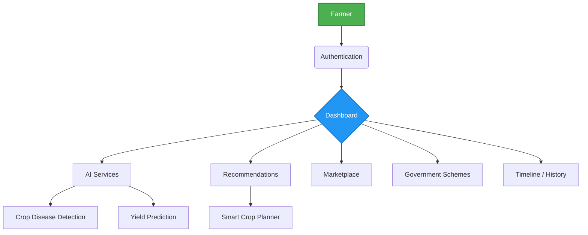

---

## 💻 Technology Stack

| Category | Technology |
| :--- | :--- |
| **Frontend** | React.js, Vite, Tailwind CSS, Framer Motion, React Query |
| **Backend** | Node.js, Express.js |
| **AI Backend** | FastAPI, Python |
| **Database** | PostgreSQL, Supabase |
| **Authentication**| JWT, Supabase Auth |
| **Maps** | Leaflet / Google Maps API |
| **Translation** | Google Translate API / Custom ML Models |
| **Deployment** | Vercel (Frontend), Render/Railway (Backend & AI) |
| **Machine Learning**| PyTorch, Scikit-learn, TensorFlow |
| **RAG** | LangChain, LlamaIndex |
| **Vector Database** | ChromaDB |
| **APIs** | OpenWeather, Gemini API, NewsAPI |

---

## 🏗️ Project Architecture

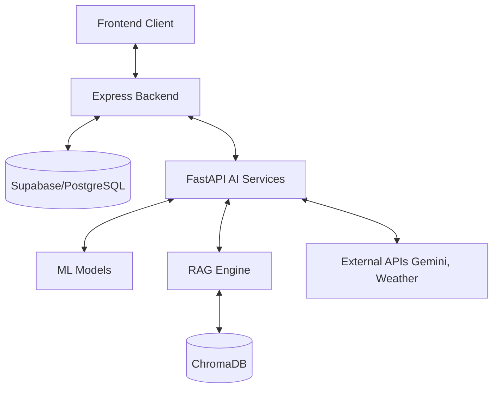

---

## 📁 Folder Structure

```text
KhedutSaathi/
├── assets/                  # Project images and screenshots
│   ├── banner/
│   ├── screenshots/
│   └── architecture/
├── frontend/                # React/Vite Frontend Application
│   ├── src/
│   │   ├── components/      # Reusable UI components
│   │   ├── features/        # Feature-based modular architecture
│   │   ├── hooks/           # Custom React hooks
│   │   ├── services/        # API integrations
│   │   ├── store/           # Global state management
│   │   └── utils/           # Helper functions
├── backend/                 # Node.js/Express Backend API
│   ├── controllers/         # Request handlers
│   ├── models/              # Database schemas
│   ├── routes/              # API endpoints
│   ├── middlewares/         # Auth, validation, error handling
│   └── config/              # Environment configurations
├── ai_models/               # ML Models and Jupyter Notebooks
├── rag_system/              # ChromaDB and Knowledge Graph configuration
└── docs/                    # Technical documentation
```

---

## 🖼️ Screenshots Section

### 📊 Dashboard
Your personalized command center for farm operations.
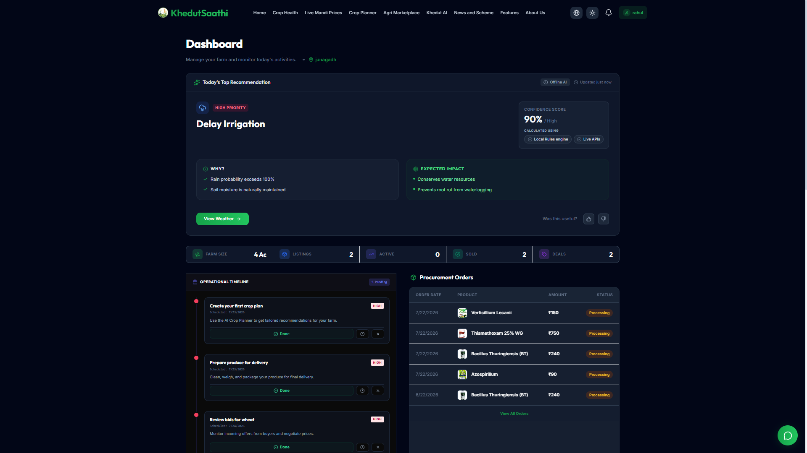
*Overview of farm metrics, weather, and recent activities.*

### 🔐 Authentication
Secure and seamless onboarding process.
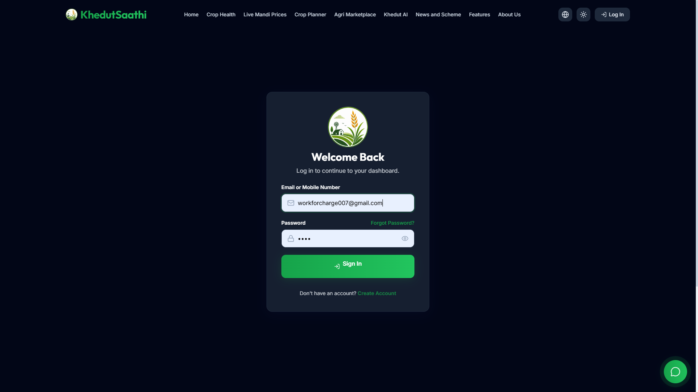
*Login and Registration portal.*

### 🦠 Crop Disease Detection
Upload images to instantly identify crop diseases.
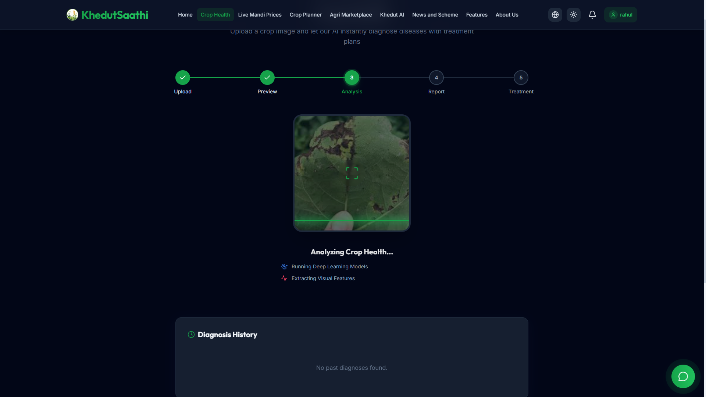
*AI-driven disease identification and cure recommendations.*

### 📅 Crop Planner
Strategic task scheduling tailored to your crop cycle.
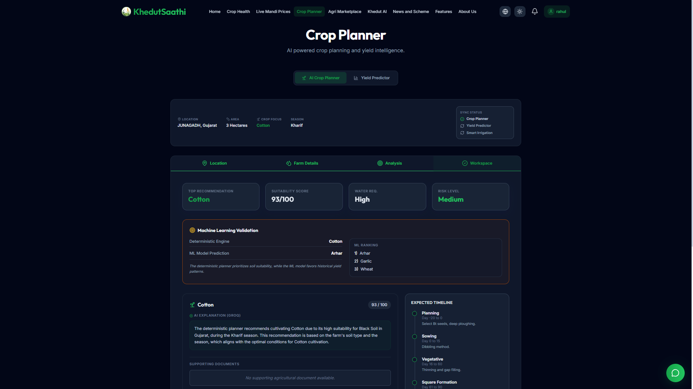
*Smart planning interface with actionable steps.*

### 📈 Yield Predictor
Forecast your harvest based on environmental variables.
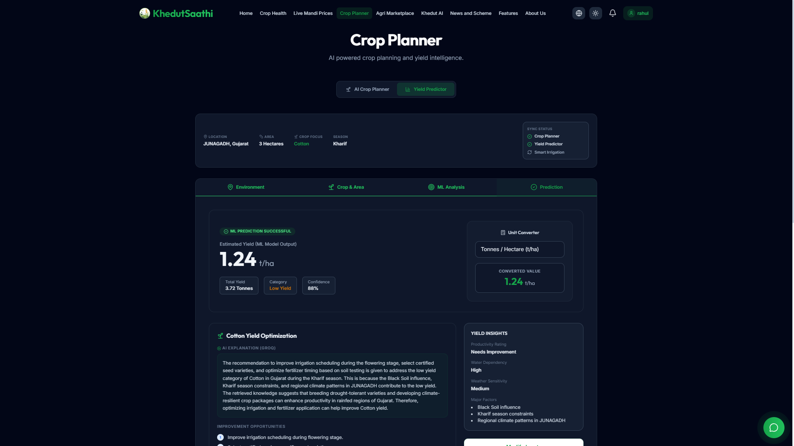
*Data visualization of expected crop yields.*

### 💹 Market Prices
Track real-time commodity prices.
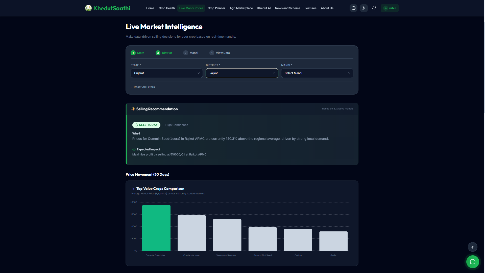
*Live market trends and historical price charts.*

### 🛒 Marketplace
Connect with buyers and sellers locally.
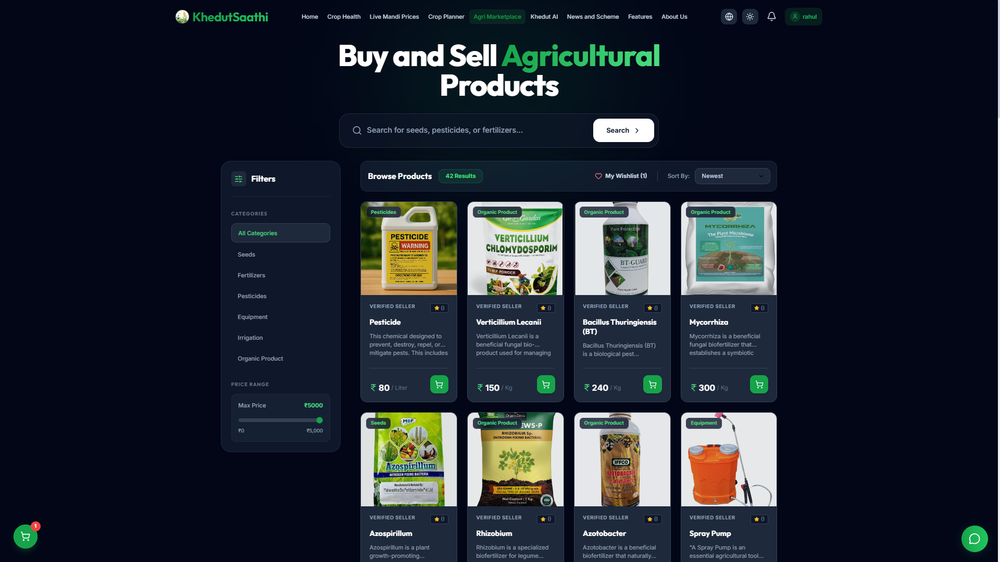
*Agri-marketplace for trading goods and equipment.*

### 🏛️ Government Schemes
Discover and apply for agricultural subsidies.
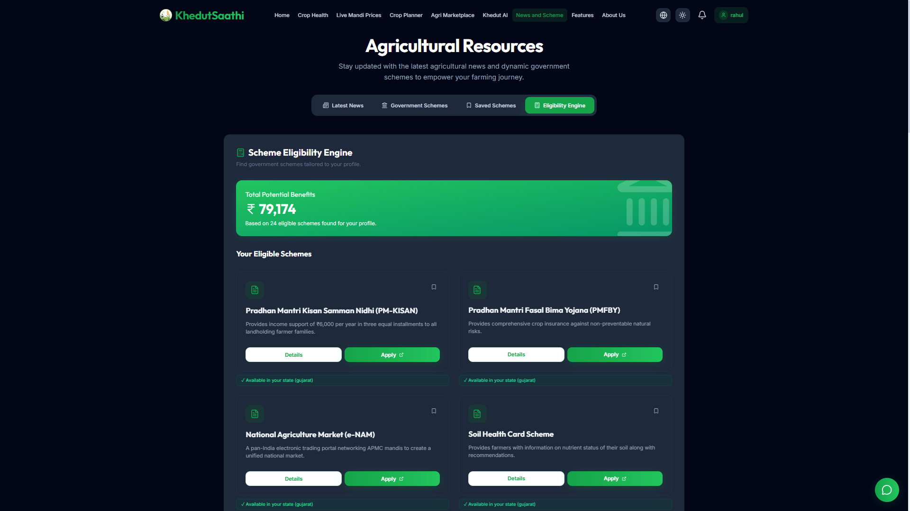
*Curated list of beneficial government initiatives.*

### 🤖 Khedut AI Workspace
Your personal intelligent farming assistant.
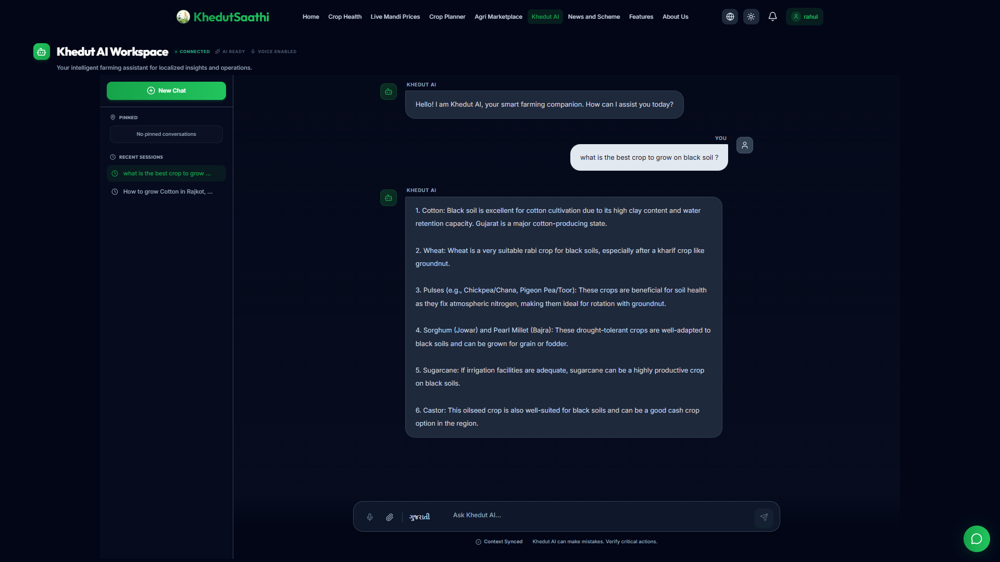
*Conversational interface for farming queries.*

### 🧠 Knowledge Engine
Semantic search across extensive agricultural databases.

*RAG-powered query resolution.*

### 🔔 Notifications
Stay updated with crucial alerts.

*Notification center for weather, markets, and tasks.*

### ⏳ Timeline
Track your farming journey.

*Chronological log of farm events.*

### 🧑‍🌾 Farmer Profile
Manage your identity and farm details.
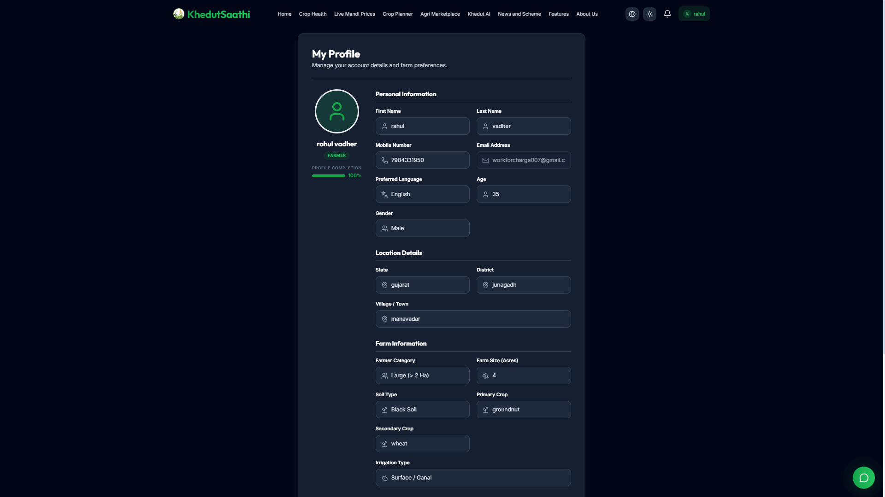
*User profile and settings management.*

### ⚙️ Settings
Customize your KhedutSaathi experience.

*Application preferences and configurations.*

### 🌙 Dark Mode
Optimized for low-light environments.

*The entire application seamlessly adapts to dark mode.*

### 📱 Responsive Mobile View
Farming intelligence on the go.

*Mobile-first design ensuring perfect usability on smartphones.*

---

## 🧠 AI Modules

- **Crop Disease Detection:** Utilizes Convolutional Neural Networks (CNNs) to analyze leaf images, detect anomalies, and suggest immediate remedial actions.
- **Yield Prediction:** Employs regression models analyzing historical weather data, soil quality, and crop type to forecast expected output.
- **Smart Crop Recommendation:** Analyzes regional soil and climate parameters to recommend the most profitable and sustainable crops to plant.
- **Khedut AI Chatbot:** Powered by LLMs tailored for agriculture, providing conversational support in local languages.
- **Knowledge Engine:** A robust RAG pipeline ingesting agricultural research papers, government guidelines, and best practices.
- **Semantic Search:** Context-aware search functionality that understands the intent behind farmer queries, rather than just keyword matching.
- **Government Scheme Recommendation:** Matching algorithms that connect a farmer's profile data with eligibility criteria for various subsidies.
- **Future AI Roadmap:** Incorporating satellite imagery analysis, pest movement prediction, and multi-agent systems for comprehensive farm management.

---

## 🔍 RAG Knowledge Engine

KhedutSaathi's Knowledge Engine is built on a sophisticated Retrieval-Augmented Generation (RAG) architecture:

1. **Document Parsing:** Ingestion of diverse formats (PDFs, HTML, Text) containing agricultural best practices and official guidelines.
2. **Chunking:** Intelligently splitting large documents into semantically coherent overlapping chunks.
3. **Embedding:** Generating dense vector representations of chunks using state-of-the-art embedding models.
4. **ChromaDB:** Storing and indexing vectors in ChromaDB for ultra-fast, scalable retrieval.
5. **Semantic Retrieval:** When a user asks a question, querying ChromaDB to find the most contextually relevant chunks.
6. **LLM Response Generation:** Passing the retrieved context to Gemini to generate an accurate, hallucination-free, and localized response.

---

## 🧪 Machine Learning Models

| Model | Purpose | Framework | Accuracy | Input | Output |
| :--- | :--- | :--- | :--- | :--- | :--- |
| **PlantDiseaseNet** | Identify leaf diseases | PyTorch | 94.5% | Leaf Image | Disease Name & Confidence |
| **YieldPredictor-XGB** | Forecast crop yield | Scikit-Learn | 89.2% | Climate Data, Soil Type | Estimated Yield (tons/ha) |
| **AgriRecommender** | Suggest best crops | TensorFlow | 91.0% | NPK Values, pH, Rainfall | Ranked List of Crops |
| **PriceForecaster-LSTM**| Predict future prices | PyTorch | 85.7% | Historical Prices, Season | Predicted Price Range |

---

## 🔌 APIs Used

- **Weather API:** OpenWeatherMap for real-time and forecasted meteorological data.
- **Gemini API:** Google's Gemini for powering the conversational interface and RAG synthesis.
- **Government APIs:** Integration with open data portals for real-time scheme updates and mandi prices (e.g., e-NAM).
- **Market APIs:** Data aggregators for current commodity pricing across different APMCs.
- **RSS Feeds:** For aggregating the latest agricultural news.
- **Maps API:** Leaflet/Mapbox for geospatial data visualization and farm mapping.

---

## 🛠️ Installation Guide

### Prerequisites
- Node.js (v18+)
- Python (v3.11+)
- PostgreSQL (or Supabase project)
- Git

### 1. Clone the Repository
```bash
git clone https://github.com/pritjasani08/KhedutSaathi.git
cd KhedutSaathi
```

### 2. Frontend Setup
```bash
cd frontend
npm install
```

### 3. Backend Setup
```bash
cd backend
npm install
```

### 4. Python / AI Setup
```bash
cd rag_system
python -m venv .venv
# On Windows
.venv\Scripts\activate
# On Mac/Linux
source .venv/bin/activate

pip install -r requirements.txt
```

### 5. Environment Variables
Copy `.env.example` to `.env` in both `frontend` and `backend` directories and configure the values.

### 6. Run the Application
**Run Backend:**
```bash
cd backend
npm run dev
```

**Run Frontend:**
```bash
cd frontend
npm run dev
```

**Run AI Services (FastAPI):**
```bash
cd rag_system
uvicorn main:app --reload
```

---

## 🔑 Environment Variables

### Frontend (`frontend/.env`)
| Variable | Description |
| :--- | :--- |
| `VITE_API_URL` | Base URL for the Express backend |
| `VITE_SUPABASE_URL` | Supabase project URL |
| `VITE_SUPABASE_ANON_KEY` | Supabase public anonymous key |

### Backend (`backend/.env`)
| Variable | Description |
| :--- | :--- |
| `PORT` | Port for Express server (e.g., 5000) |
| `DATABASE_URL` | PostgreSQL connection string |
| `JWT_SECRET` | Secret key for JWT signing |
| `AI_SERVICE_URL` | URL for the internal FastAPI service |
| `GEMINI_API_KEY` | Google Gemini API Key |

### AI Services (`rag_system/.env`)
| Variable | Description |
| :--- | :--- |
| `CHROMA_DB_PATH` | Local path for ChromaDB storage |
| `EMBEDDING_MODEL` | Model name for vector embeddings |

---

## 🎭 Demo Credentials

> **Note:** The live demo is currently running at `[Demo Link Placeholder]`.

To access the platform as a test user, use the following credentials:

| Role | Email | Password |
| :--- | :--- | :--- |
| **Farmer (Admin)** | `farmer@khedutsaathi.com` | `khedut123` |
| **Buyer** | `buyer@khedutsaathi.com` | `buyer123` |

---

## ⚡ Performance

- **Lazy Loading:** Code splitting and lazy loading of React components to ensure ultra-fast initial page loads.
- **React Query:** Aggressive caching, background fetching, and optimistic UI updates for a seamless experience.
- **Optimized AI Requests:** Streaming responses from LLMs to reduce perceived latency.
- **Skeleton Loading:** Widespread use of skeleton loaders to prevent layout shifts and improve perceived performance.
- **Incremental Retrieval:** Paginated data fetching for marketplace and timeline to conserve bandwidth.

---

## 🛡️ Security

- **JWT Authentication:** Stateless, secure token-based authentication with short expiration and refresh mechanisms.
- **Password Hashing:** Bcrypt encryption for all user passwords.
- **Rate Limiting:** IP-based rate limiting on sensitive API routes to prevent brute-force and DDoS attacks.
- **Helmet:** Secure HTTP headers configured to protect against common web vulnerabilities.
- **Input Validation:** Strict validation using Zod/Joi to sanitize incoming payloads.
- **Role-Based Access (RBAC):** Granular permission systems differentiating Farmers, Buyers, and Admins.

---

## 🛣️ Future Roadmap

- [ ] **Drone Integration:** Connect with agricultural drones for aerial surveys and targeted spraying.
- [ ] **IoT Sensors:** Direct integration with soil moisture and temperature sensors.
- [ ] **Digital Twin:** Create digital representations of physical farms for advanced simulations.
- [ ] **Satellite Analytics:** NDVI and hyperspectral imaging for macro-level crop health monitoring.
- [ ] **Precision Irrigation:** Automated smart water management systems.
- [ ] **Multi-Agent AI:** Specialized AI agents collaborating to manage complex farm logistics.
- [ ] **Offline Mode:** Full PWA offline support with local-first synchronization.
- [ ] **Farmer Community:** Social network features for localized farmer-to-farmer knowledge sharing.
- [ ] **Voice Assistant:** Voice-first interactions across the entire platform in regional dialects.

---

## 👥 Contributors

<div align="center">
  <a href="https://github.com/pritjasani08/KhedutSaathi/graphs/contributors">
    
  </a>
</div>

---

## 🏆 Awards & Achievements

- **🏆 [Placeholder: Biothon Grand Finale Winner 2026]** - Recognized for the most impactful agricultural innovation.
- **🏆 [Placeholder: National Agri-Tech Innovation Challenge]** - Best use of AI in farming.
- **🏆 [Placeholder: Smart India Hackathon]** - Top 3 Finalist in the Smart Agriculture track.
- 🥉 **Biothon 2026 – 3rd Place Overall (Agriculture Department)** – Awarded for Khedut Saathi AI.
- 🏆 **Biothon 2026 – Best Software Solution** – Ranked #1 for developing the best software-based agriculture application.
---

## 📄 License

This project is licensed under the [MIT License](LICENSE). 
You are free to use, modify, and distribute this software as per the terms of the license.

---

## 🙏 Acknowledgements

We extend our deepest gratitude to:
- **Libraries:** The open-source maintainers of React, Node.js, FastAPI, and PyTorch.
- **Datasets:** ICAR, Ministry of Agriculture & Farmers Welfare, and Kaggle communities for open agricultural datasets.
- **Mentors:** Our project guides and industry experts for their invaluable feedback.
- **University:** [University Name Placeholder] for providing the environment and resources to build this project.

---

<div align="center">
  <p><b>Made with ❤️ for Indian Farmers</b></p>
  <p>
    <a href="https://github.com/pritjasani08">GitHub</a> •
    <a href="#">LinkedIn</a> •
    <a href="#">Website</a> •
    <a href="mailto:hello@khedutsaathi.com">Email</a>
  </p>
</div>
